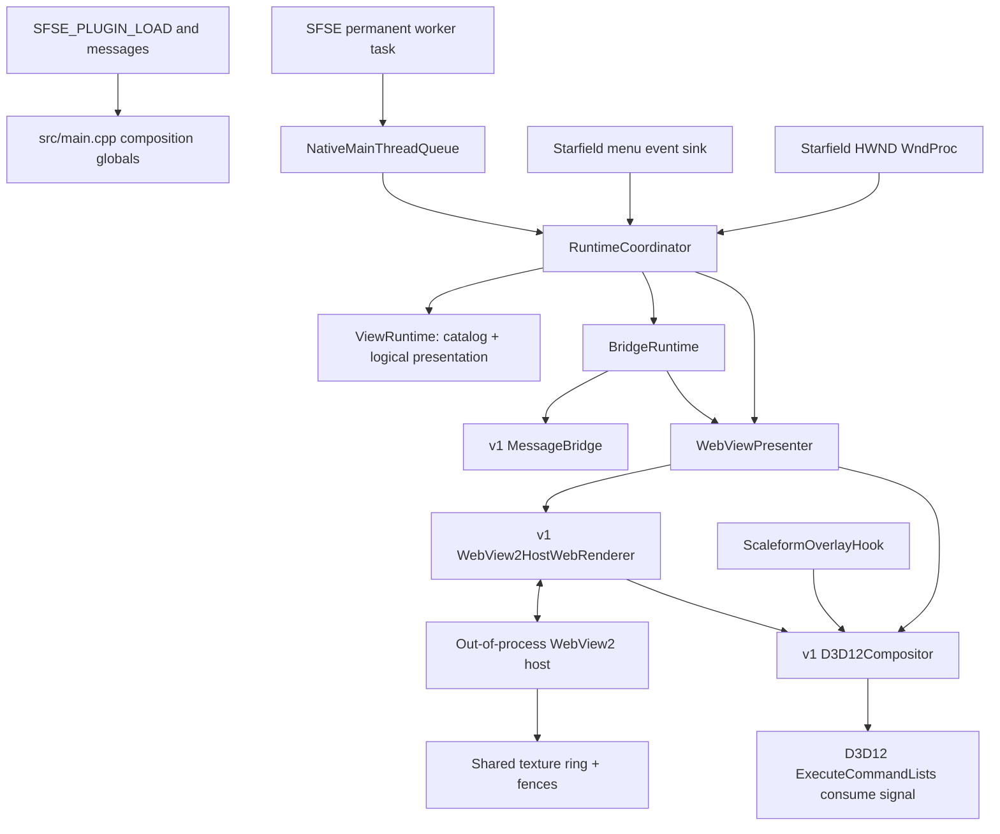
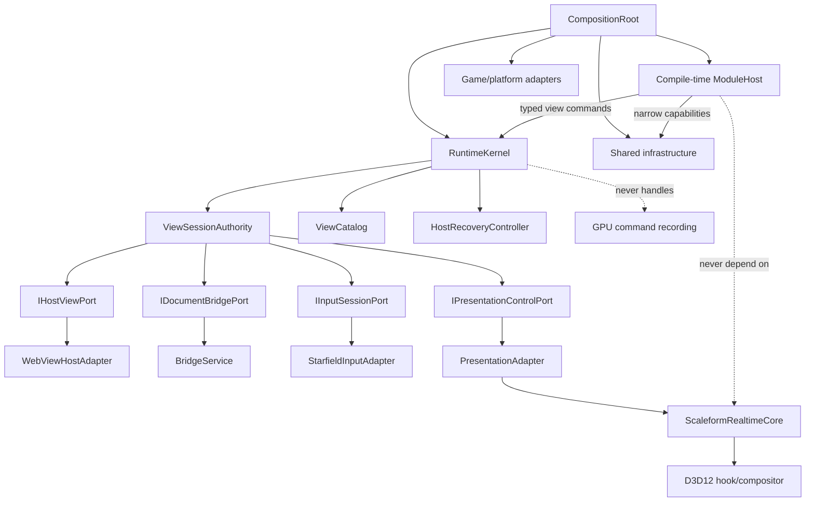
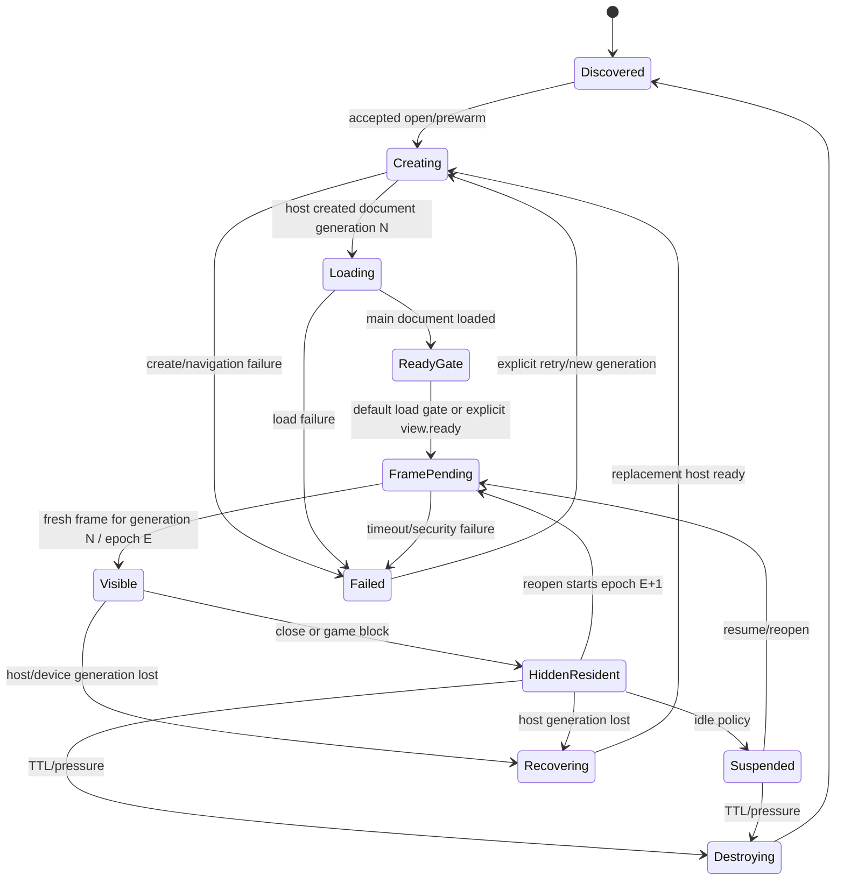
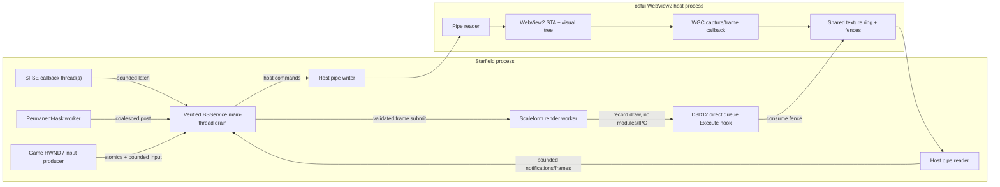

# OSF UI v2 Target Architecture and Migration Report

## 1. Executive verdict

The proposed modular-core direction is **better only if strict dependency and ownership rules are enforced**.

The useful improvement is not moving `Runtime` into more files. It is establishing:

- One main-thread `ViewSessionAuthority` as the sole owner of desired view state, document generations, readiness, presentation, focus, capture, pause, and recovery intent.
- Narrow capability ports supplied at composition time.
- Compile-time feature composition with runtime lifecycle/fault isolation.
- A hard boundary around the existing WebView2, IPC, D3D12, and Scaleform mechanisms.
- No feature-module or general kernel calls from the render hook.

The existing v1 mechanisms are often strong and should be ported rather than replaced: the Scaleform hook protocol, shared-texture/fence transport, host peer verification, message-envelope semantics, input integration, stale-frame gating, recovery policy, persistence, and bounded queues.

Current v2 is a useful thin vertical slice, but not yet a replacement runtime:

- Its coordinator and presenter duplicate lifecycle truth.
- It lacks bounded host recovery, residency, configuration, toggle/gamepad input, most bridge features, the native API, and almost all shipped Papyrus functions.
- `ViewStartupPolicy` exists but is not called.
- All v2 views are currently converted to `nativeBridge=true`, bypassing v1’s manifest default-deny permission contract.
- HUD ordering is represented logically but not applied to the host.
- A credible static reopen defect exists: `Hide()` leaves presenter readiness latched, and `Show()` can re-enable the compositor’s cached old frame before a fresh presentation-epoch frame is submitted.
- The shipped JS/Papyrus/native documentation substantially exceeds what the current v2 production target implements.

Chosen product policies:

- First supported milestone: **player-safe core**, not full v1 API parity.
- First reveal: preserve v1 policy—load plus fresh frame by default; explicit `view.ready` only when requested by the manifest.
- Host recovery: restore previously open views, but only after all replacement-generation invariants are re-proven.
- Deferred v1 interfaces must be explicitly labeled unavailable during the milestone; they must not silently appear supported merely because stale SDK files are shipped.

Evidence obtained in this review:

- Static inspection: current v1/v2/runtime/host/frontend/build/test source.
- Unit proof: current `osfui-v2-tests` passed.
- Native subsystem proof: all 34 native suites passed through MSVC.
- Host-driver proof: not performed in this review.
- Build/deployment proof: not performed; the main auto-deploying build was deliberately avoided.
- Fresh in-game proof: pending.
- Repository remained clean.

---

## 2. Current v1 capability inventory

Although the production target now compiles `src/v2`, retained v1 remains the complete behavioral reference.

| Capability | V1 owner/location | Important behavior and dependencies |
|---|---|---|
| Plugin boot | `core/Plugin.cpp`, `runtime/Runtime.cpp` | Validates SFSE services, initializes paths/config/runtime, installs hooks at lifecycle messages, and coalesces permanent-task notifications onto the proven BSService drain thread. |
| Shutdown | Process-lifetime runtime and host objects | No dependable SFSE DLL-unload lifecycle. Objects intentionally survive until process exit; the host also watches the game process/window. |
| Main-thread coordination | `Runtime::Tick`, `DeferredMainThreadWork` | One ordered tick drains cross-thread producers, applies policy, advances bridge/browser state, and submits the newest frame. |
| Scaleform render integration | `ScaleformOverlayHook` | Hooks Begin/End/Composite and D3D12 command-list methods; recognizes the correct Scaleform render target and chains only proven-compatible foreign Composite ownership. No Present hook. |
| D3D12 integration | `EngineD3D12`, `D3D12Compositor` | Validates engine device/direct queue identity, samples shared textures, tracks barriers/heaps/format, signals consumption after the exact command lists execute, and retains uncertain GPU resources rather than freeing unsafely. |
| Host process/IPC | `WebView2HostWebRenderer`, host executable, protocol v6 | Owner-only named pipe, verified peer PIDs, bounded handshake and heartbeat, reader/writer threads, multiple WebViews, and one shared four-slot texture ring. |
| Browser security | Host setup/security handlers | Chromium remains out of process; network requests are denied; network constructors/workers are removed; scripted popups are blocked; user-gesture links leave through the system browser. |
| View discovery | `ViewManager`, `ViewManifest` | Fixed two-level path-derived identity, deterministic sorting, flat-layout rejection, entry containment, HUD safety normalization, advisory target version, debug filtering, ordering, readiness, and permissions. |
| Presentation policy | `ViewPresentationController`, `Runtime` | One menu plus multiple HUDs; stable HUD order; menu replacement; active view visibility/focus publication. |
| First reveal | `Runtime` presentation/reveal logic | Requires successful load or explicit `view.ready`, known output size, and a frame newer than the current opening epoch. The compositor remains hidden until then. |
| View residency | `ViewLifecycle` | Hidden suspension after 90 seconds; destruction after 25 minutes or hidden-view pressure; pinned views exempt; destroyed views return to discovered state. |
| Startup policy | `ViewPolicyStore`, runtime startup | Only eligible HUDs auto-start; player override beats author default; menus do not auto-start from filesystem discovery. |
| Input routing | `OverlayInputHook` | Subclasses only Starfield’s HWND; consumes raw and legacy input only while captured; always protects the toggle/rebind path. |
| Keyboard/layout | `KeyNames`, `KeyLabels`, runtime | Physical scan-code identity, layout-derived labels, reserved keys, capture/rebind, accelerator mirroring, and conflict diagnostics. |
| Mouse/cursor | WndProc hook, `HardwareCursor`, host | Raw mouse routing, coalesced movement, buttons/wheel, CSS cursor-shape mirroring, and focus restoration. |
| Controller | `EngineInput`, `XInputPoller`, `GamepadNavigation` | Engine events plus focus-independent XInput fallback; raw opt-in events; navigation/back mappings and active-mode gates. |
| Focus ownership | `FocusMenu`, browser-host focus | Real native WebView focus for capturing menus, a Starfield focus menu/watchdog, and rollback when focus cannot be established. |
| Engine control/pause | `ControlLayer`, `SimPause` | Session-held input layer and balanced pause-counter changes; restored immediately on failure/close. |
| Pause-menu integration | `MainThreadMenuPump`, `PauseMenuEntry` | Injects a safe entry after active-menu advancement and avoids mutating Scaleform from arbitrary callbacks. |
| Bridge protocol | `MessageBridge` | Page-initiated hello; strict send/request kinds; exactly-once settlement; bounded deferred work; ready → state → events ordering; per-document event gates. |
| Retained state/events | `RetainedStateStore`, bridge | Latest-wins values replay after reload/recovery; events are bounded and never replayed; Papyrus state is session-scoped. |
| Platform web endpoints | `Runtime` bridge registration | Menu/view operations, logging, readiness, settings, links, game state, Papyrus calls/actions, and view policy. |
| Native plugin API | `BridgeApi`, `OSFUI_RequestBridge` | Thread-safe endpoint registration, state/events, menu requests, settings/schema/hotkey subscriptions, health reporting, version negotiation, and a 1.x adapter. |
| Papyrus API | `PapyrusApi`, shipped `OSFUI.psc` | Settings, subscriptions, hotkeys, state/events, correlated requests/replies, form serialization, registration reset on game load, and menu control. |
| Settings | `SettingsStore`, `SettingsModule` | File/native schema precedence, validation, migration/aliases, typed values, write-behind persistence, quarantine/retry, hot reload, and key capture. |
| Hotkeys | `HotkeyService`, subscriptions | Settings-backed physical bindings, context/mode gating, web/native/Papyrus delivery, and non-consuming gameplay dispatch. |
| Localization | `LocalizationService` | Game-locale normalization, per-mod catalogs, fallback, reload, and derived label refresh. |
| Diagnostics | `HealthRegistry`, health coordinators | Stable issue identities, severity/history, path redaction, bounded producer queues, host/platform health, and built-in presentation. |
| Developer workflow | `DevViewFiles`, reload worker, DevTools | File watching, controlled document reload, console routing, DevTools, and compatibility warnings. |
| Built-in views | `frontend/src/views` | Settings, keybindings, and first-load handoff, backed by retained platform state and feature endpoints. |
| Author SDK/tooling | `frontend/src/shared-kit`, `sdk`, schemas, CLI/tests | Typed bridge helper, theme/i18n/navigation helpers, compatibility façade, stable generated assets, author schemas, and desktop harness. |
| Resize/device/game lifecycle | Runtime, renderer, compositor, Papyrus load sink | Output-size feedback resizes host surfaces; load resets session-scoped Papyrus state. True renderer/device replacement is not a mature recoverable path. |

Notable awkward evidence:

- `Runtime` is simultaneously composition root, lifecycle authority, policy engine, bridge assembler, feature coordinator, and recovery controller.
- `IUiModule` only normalizes lifecycle fan-out; `Runtime` still reaches through concrete module types.
- Settings state is published too broadly: every bridge-enabled view receives the complete registry.
- All views share one mapped filesystem root and can read sibling view assets.
- Some deliberate process-lifetime objects are engine-safety choices, not accidental leaks.

---

## 3. Current v2 runtime walkthrough

### Current component/dependency flow



### Concrete execution

1. `SFSE_PLUGIN_LOAD` in [src/main.cpp](</C:/Modding/Starfield/OSF UI/src/main.cpp:1>) validates messaging/task interfaces, creates process-lifetime presenter/runtime objects, initializes the renderer/compositor, discovers views, registers the SFSE listener, and adds a permanent task.
2. `kPostLoad` installs the Scaleform hook and reports draw-path availability to the presenter.
3. `kPostDataLoad` latches Papyrus registration.
4. `kPostPostDataLoad` latches WndProc installation and currently registers the menu sink directly.
5. A permanent task may execute on rotating render-graph workers. It coalesces one post to `NativeMainThreadQueue`; only the proven BSService queue-drain owner runs `RuntimeCoordinator::Tick`.
6. View discovery parses the two-level filesystem layout and replaces `ViewRuntime`’s catalog.
7. Open requests arrive from Papyrus, the minimal web bridge, or tests. The coordinator validates known ID, blocking-menu state, input availability, and queue capacity.
8. `ViewRuntime` selects the active menu/HUD set and emits Show/Hide commands.
9. `WebViewPresenter::Show` checks initialization and live draw availability, creates/navigates a host document if needed, unhides it, and selects the menu input target.
10. `BridgeRuntime` arms a `MessageBridge` document gate only when the presenter reports a newly created document.
11. `WebView2HostWebRenderer` lazily launches the host, performs the v6 handshake, sends bootstrap view state, and exchanges JSON over its worker/writer threads.
12. The host STA owns WebView2 controllers. Windows Graphics Capture publishes the already-composited view stack into a shared D3D11/D3D12-compatible texture ring.
13. The game-side reader validates presentation epoch/ring generation and makes the latest frame available.
14. On the main tick, the presenter calls renderer `Update`/`Render`, submits the frame descriptor to `D3D12Compositor`, and emits Ready after a frame newer than its load floor.
15. The Scaleform render hook later samples the submitted shared slot on the engine command list. The direct-queue execution hook signals the consume fence after submission.
16. Input-capturing menus acquire browser focus, ControlLayer, and SimPause only after Ready. Capture is published to the window thread last.
17. Hide removes logical visibility and hides the host view, but does not destroy/suspend it or invalidate presenter readiness.
18. Per-view load failure closes that view. Any renderer/transport/draw-path failure becomes terminal to the whole presenter and closes every view. There is no v2 restart path.

### Status classification

| Area | Status |
|---|---|
| Discovery, catalog, one-menu/multi-HUD logical state | Implemented and unit-tested |
| Papyrus version/open/close | Implemented and unit-tested |
| Minimal bridge: hello, close, menu open/close, ping, log | Implemented and unit-tested |
| Main-thread scheduling and fail-closed queue fallback | Implemented |
| Existing host/IPC/frame/compositor/hook mechanisms | Reused and operationally substantial; not newly proven by an in-game test in this review |
| Focus/capture/pause rollback | Implemented and unit-tested for current path |
| Startup policy | Implemented as a pure function, but unused |
| Multiple-view ordering | Logical only; not passed to the host presenter |
| Manifest security permissions | Missing from v2 model; conversion currently grants bridge access to all views |
| Host recovery | Renderer supports reset/restart, but v2 never invokes it |
| Hide/suspend/destroy/residency | Hide only; suspend/destroy absent |
| Config, toggle, keyboard labels, gamepad, cursor mirroring, pause entry | v1 only |
| Retained state, settings, localization, health, hotkeys | v1 only |
| Native C ABI | Source remains, but excluded from the production v2 target |
| Full shipped Papyrus API | Documented/shipped, but only four functions are currently bound |
| Built-in view functionality | Content exists, but its data producers/endpoints are mostly absent |
| Save/load reset behavior | v1 only |
| Device-loss recovery | Unsupported |
| SDK/public-contract versioning for thin v2 | Not yet resolved in code/package layout |

---

## 4. Problems and coupling found

### Lifecycle and ownership

- `RuntimeCoordinator` separately tracks known, capturing, instantiated, and ready view IDs while `ViewRuntime`, `BridgeRuntime`, `WebViewPresenter`, and the host each hold overlapping lifecycle state.
- Events carry strings without a document generation. A delayed load/frame/failure from an old document can be difficult to distinguish from the current one.
- Logical open state, host visibility, document readiness, compositor visibility, and engine policy are changed by different objects without one transaction owner.
- Single-view destruction is absent, so bridge gates and deferred requests remain live for hidden resident documents.
- Host failure is escalated to a permanent presenter failure even though the renderer already has a restart mechanism.

### Security and public contract

- v2 manifest conversion forces `nativeBridge=true`; default-deny author intent is lost.
- The v2 manifest omits several supported v1 fields, including permissions, order, readiness, debug status, descriptive metadata, and target version.
- The production binary’s API surface does not match the shipped Papyrus/TypeScript/native documentation.
- The v1 settings-disclosure and shared-root asset gaps should not be carried forward unnoticed.

### Render and thread safety

- The hook/compositor is a specialized real-time subsystem and must not depend on modules, service registries, JSON, IPC, or general virtual interfaces.
- The existing compositor still uses mutexes, lazy setup, and a command-list tracking map on sensitive paths. These are characterization targets, not justification for adding more abstraction there.
- `kPostPostDataLoad` is not proof of main-thread execution. Registration that touches engine-owned sources should be latched and consumed at the verified main-thread checkpoint.
- WndProc callbacks need bounded, allocation-free handoff; they must not invoke feature logic directly.

### Maintainability

- `IViewPresenter` combines document creation, focus, input, transport, frame advancement, and failure reporting.
- `BridgeRuntime` is small now, but would become another central manager if every feature is added directly to it.
- “Shared services” would regress into globals if modules can discover arbitrary services or retain writable registries.
- A dynamic module-loader ABI would add versioning and failure complexity without isolating code in another process.

---

## 5. Proposed architecture

### Verdict and dependency rule

Use a **hybrid module model**:

- Concrete modules are selected and constructed at compile time.
- They implement a small runtime lifecycle contract.
- They receive explicit narrow ports through constructors.
- Optional modules may be omitted from the composition root.
- Third-party SFSE plugins continue through the versioned C ABI; they are not runtime-loaded internal modules.

Default feature communication:

1. A module sends authority-changing intent through a typed command port.
2. The owning component publishes immutable typed events for observers.
3. Read access uses an immutable snapshot or purpose-specific query port.
4. Modules never cast, locate, or hold another concrete module.
5. No writable shared-state store.
6. Direct calls are justified only inside tightly integrated correctness aggregates such as presentation/input acquisition.

### Target dependency flow



### What belongs in the kernel

- Runtime readiness and failure transitions.
- Main-thread ordering.
- View catalog ownership.
- One authoritative view-session model.
- Atomic presentation/input/pause acquisition and rollback.
- Host-recovery orchestration.
- Required/optional module lifecycle.
- No settings schemas, localization data, hotkey policy, Papyrus details, WebView2 calls, JSON files, or D3D12 objects.

### What remains tightly integrated

`ViewSessionAuthority`, presentation readiness, focus, ControlLayer, pause, and compositor visibility form one correctness aggregate. Splitting each into independently reacting modules would create unsafe transient states.

The render hook, frame slot, fence serial, descriptor heaps, render-target proof, and queue-execution tracking remain a concrete presentation subsystem. Its hot path must contain:

- No module calls.
- No IPC.
- No filesystem or JSON.
- No blocking waits.
- No unbounded allocation.
- No general event dispatch.
- No newly introduced virtual dispatch.

---

## 6. Component and ownership table

### A. Runtime kernel

| Component | Responsibility and owned state | Receives / must never access | Ports | Owner, thread, failure, status, absorbed behavior |
|---|---|---|---|---|
| `RuntimeKernel` | Global readiness, ordered main tick, blocking-game state, required subsystem health | Receives scheduler, catalog, session authority, module host, diagnostics; never touches WebView2/D3D12/Win32/Papyrus concrete APIs | `Start`, lifecycle notifications, `Tick`, readiness snapshot | Created by composition root; process lifetime in production; main thread; required. Required-component failure closes presentation and enters degraded/terminal state. Absorbs coordinator ordering. |
| `ViewSessionAuthority` | Sole mutable record for desired-open state, residency, document generation, readiness gates, presentation epoch, focus/capture/pause ownership, recovery intent | Receives host/presentation/input/bridge capabilities; never reaches modules or concrete adapters | `RequestOpen/Close`, `OnHostEvent`, `OnFrame`, `Snapshot` | Kernel-owned; main thread; required. Per-view faults remain per-view; invariant failure revokes all presentation. Absorbs `ViewRuntime`, controller, coordinator sets, presenter sets, v1 reveal/lifecycle policy. |
| `ModuleHost` | Ordered module lifecycle and per-module enabled/fault state | Receives fixed module instances and capability bundles; never acts as service locator | `StartAll`, `TickOptional`, `StopAll`, `NotifyDocument/GameSession` | Composition-root-created, kernel-driven, main thread. Required-module failure blocks readiness; optional-module failure disables only that module. Replaces v1’s weak lifecycle fan-out. |

### B. Shared infrastructure

| Component | Responsibility and owned state | Receives / must never access | Ports | Owner, thread, failure, status, absorbed behavior |
|---|---|---|---|---|
| `ViewCatalogService` | Immutable discovered descriptors and stable IDs | Manifest records from discovery; never creates documents | `Find`, `All`, catalog revision | Kernel-owned; main-thread publication, immutable cross-thread snapshots; required. |
| `BridgeService` | Envelope validation, endpoint ownership, document gates, deferred requests, retained state/events | Transport, security identity, clock, diagnostics; never opens views except through `IViewCommands` | Endpoint registrar, state/event publisher, document lifecycle | Kernel-owned; main thread; required only for bridge-enabled views. Preserve v1 `MessageBridge` semantics. |
| `SecurityPolicy` | Permission derivation and source/target authorization | Validated descriptors and trusted source identity; never trusts payload-supplied mod/view authority | `AuthorizeBridge`, `AuthorizeEndpoint`, `ProjectState`, `HostPolicy` | Required, immutable after discovery revision; policy failure denies capability. |
| `ConfigStore` | Typed configuration snapshots and atomic persistence | Filesystem store and diagnostics; never invokes features | Typed `Read`, transactional `Update`, change events | Infrastructure-owned; main-thread commits, read-only snapshots elsewhere; required for player-safe core. |
| `RecoveryController` | Bounded host restart budget, desired-state restoration transaction, deadlines | Host lifecycle port, clock, session snapshots; never manipulates input/GPU directly | `OnFailure`, `Poll`, `ManualRetry` | Kernel-owned, main thread; required. Exhaustion leaves views closed and runtime usable without presentation. |
| `DiagnosticsSink` | Bounded structured issue ingestion, sanitization, counters, snapshots | All components through narrow sink; never grants control authority | `Report`, `Resolve`, snapshot/events | Shared required sink; producers may call from threads through bounded queues; aggregation main-thread. V1 health behavior. |
| `MainThreadInbox` | Bounded/coalesced cross-thread commands | WndProc, SFSE workers, adapters; never executes on producer thread | `TryPost`, `Drain` | Scheduler-owned; process lifetime; required. Overflow fails closed and reports diagnostics. |
| `PersistenceStore` | Safe JSON read/replace/quarantine primitives | Filesystem adapter; never knows settings/view semantics | `Read`, `ReplaceAtomically`, `Quarantine` | Shared infrastructure; main-thread or dedicated non-render worker; optional consumers fail independently. |

### C. Game/platform adapters

| Component | Responsibility and owned state | Receives / must never access | Ports | Owner, thread, failure, status, absorbed behavior |
|---|---|---|---|---|
| `SfseLifecycleAdapter` | Translate SFSE load messages and permanent tasks into latched kernel notifications | SFSE interfaces; never calls feature logic from callbacks | lifecycle events, tick notification | Composition-root-owned; callback thread → inbox; required. |
| `StarfieldMainThreadScheduler` | Prove and use BSService drain ownership | Engine queue; never unsafe-inline fallback | `TrySchedule` | Process lifetime; worker producer/main consumer; required. Preserve v2 queue behavior. |
| `StarfieldUiAdapter` | Menu events, loading/main-menu blocks, focus menu, pause-menu safe pump | Starfield UI APIs; never owns view policy | typed UI lifecycle/focus capabilities | Main-thread transitions; optional pause entry, required blocker/focus portions. |
| `StarfieldInputAdapter` | WndProc, raw keyboard/mouse, controller, cursor, ControlLayer, SimPause | Session snapshot and bounded inbox; never queries modules | `IInputSessionPort`, input observations | Window/input producers plus main-thread policy application; required for capturing views. Failure refuses capturing menus. |
| `PapyrusGateway` | Bind natives and marshal calls | VM and narrow settings/view/state ports; never accesses kernel internals | versioned Papyrus functions | Main-thread binding; optional beyond four player-core natives. Game-load resets session registrations. |
| `NativePluginGateway` | Export/version C ABI and bounded producer queues | Explicit feature ports; never returns internal objects | `OSFUI_RequestBridge` ABI | Optional/deferred. ABI faults isolated from kernel. |
| `ViewFilesystemAdapter` | Scan two-level layout and load bytes | Filesystem/path policy; never creates runtime sessions | discovery result | Boot/reload worker, publishes on main thread; required. Invalid views are isolated. |
| `WebViewHostAdapter` | Host process, pipe protocol, controllers, security installation, frame transport | Host policy/descriptors; never applies game input/pause | host/document/frame/message ports | Main-thread API with private worker/writer; host STA owns WebView2. Required for presentation. Host failure ends one host generation, not kernel lifetime. |
| `ScaleformPresentationAdapter` | Draw-path proof, compositor visibility, frame submission, output/device generations | Session commands and host frames; never sees modules/bridge JSON | main-thread presentation control plus concrete real-time core | Main thread + render worker + queue hook; required. Failure revokes all presentation. |
| `WindowsPlatformAdapter` | Paths, process launch, shell targets, clock/layout/XInput where required | Narrow callers; never owns feature state | purpose-specific ports | Thread-affinity declared per operation; optional actions fail independently. |

### D. Feature modules

| Module | Coherent feature/state | Capabilities and forbidden access | Lifecycle/thread/failure | Absorbed behavior |
|---|---|---|---|---|
| `ViewPolicyModule` | HUD auto-start choices and residency policy | Catalog, config/persistence, view commands; no host/compositor | Main thread; optional policy failure uses safe defaults | `ViewPolicyStore`, `ViewLifecycle` policy portions |
| `ToggleAndLauncherModule` | Player toggle, Escape/back, pause-menu entry, chosen default view | Input observations, config, view commands, Starfield UI launcher port; no renderer | Main thread; optional, but player-safe milestone requires at least one reliable launcher | v1 toggle and pause entry |
| `GamepadNavigationModule` | Controller-to-web navigation and raw opt-in grants | Controller observations, active input-session snapshot, host input port; no view mutation except typed back command | Main thread; failure disables controller input only | v1 engine/XInput navigation |
| `SettingsModule` | Schemas, values, validation, persistence, settings endpoints/state | Config/persistence, bridge publisher, diagnostics; no concrete UI/view module | Deferred optional module; failure unregisters settings endpoints | v1 settings stack |
| `HotkeyModule` | Settings-backed bindings, conflicts, gameplay dispatch | Settings read/events, input observations, Papyrus/native delivery ports | Deferred; failure leaves ordinary view input intact | v1 hotkeys/keybinding catalog |
| `LocalizationModule` | Locale and per-mod catalogs | Locale/filesystem, bridge state publisher | Deferred; fallback English/keys on failure | v1 localization |
| `DiagnosticsModule` | Player-facing diagnostic projection/actions | Diagnostics snapshots, bridge publisher, fixed platform actions | Deferred UI module; collection sink remains available without it | Health UI/state |
| `DeveloperToolsModule` | Reload, DevTools, console routing, protocol feedback | Dev-mode config, file watcher, document commands, diagnostics | Optional and disabled in release configuration | v1 developer workflow |

A module is therefore a compile-time-selected feature object with coherent owned state, explicit lifecycle, declared capability bundle, no concrete sibling dependencies, isolated tests, and a failure policy. Content such as the settings HTML view is not itself a native module. Neither the compositor nor the WebView host is a module; they are platform adapters.

---

## 7. Capability migration matrix

| Capability | V1 location | Current v2 | Target owner / required interfaces | Difficulty | Must preserve | Disposition |
|---|---|---|---|---|---|---|
| SFSE boot/tick | Plugin + Runtime | Thin v2 path works | Kernel + lifecycle/scheduler adapters | M | Verified main-thread drain, coalescing | Redesign |
| Scaleform hook | Composite subsystem | Reused | Presentation adapter/realtime core | H | No Present hook, Luma policy, fail-closed proof | Port unchanged initially |
| D3D12 compositor | Composite subsystem | Reused | Presentation adapter | H | Shared texture, fences, heap restore, FG behavior | Port, characterize |
| Host/IPC | Renderer/host | Reused | WebView host adapter | H | Peer PID, heartbeat, bounded transport, epochs | Port |
| Host recovery | Runtime recovery | Absent | Recovery controller + sessions | H | Bounded retry and complete rehydration | Redesign |
| Discovery/path identity | ViewManager/Manifest | Partial | Filesystem adapter + catalog | M | Two-level identity, deterministic errors | Port |
| Full manifest | ViewManifest | Reduced | Catalog + security policy | M | Permissions, order, readySignal, debug/target metadata | Port |
| Logical view handles | String IDs | String IDs | Catalog-issued generational handles | M | Stable qualified IDs externally | Redesign |
| One menu/many HUDs | Presentation controller | Logical support | Session authority | M | Replacement and deterministic HUD order | Port |
| Fresh-frame reveal | Runtime | Partial; reopen hazard | Session authority + frame generations | H | No stale/transparent flash | Redesign |
| Focus/capture/pause | Runtime/input | Basic support | Session authority + input adapter | H | Atomic acquisition/rollback | Port |
| Keyboard/mouse | Input/runtime | Basic subset | Input adapter | M | Raw mouse and capture boundary | Port |
| Toggle/layout/rebind | Runtime/settings | Absent | Launcher + settings/hotkey modules | M | Reliable escape path, physical keys | Redesign/phase |
| Controller | EngineInput/XInput | Absent | Gamepad module/input adapter | M | Focus-independent operation, raw opt-in | Port for player core |
| Cursor shape | Host/input | Absent | Input adapter | L | CSS cursor mirroring | Port |
| Startup/HUD policy | ViewPolicyStore | Function unused | ViewPolicy module | M | Player override and HUD-only startup | Port |
| Suspend/destroy | ViewLifecycle | Absent | Session authority + policy module | M | Pinned exemptions and document cleanup | Port |
| Bridge core | MessageBridge | Minimal reuse | Bridge service | M | Strict kinds, bounds, hello ordering | Port |
| Permissions | Manifest/bridge/host | Bridge forced on | Security policy + host/bridge | H | Default deny and trusted identity | Replace current v2 behavior |
| Retained state/events | Store/bridge | Absent | Bridge service | M | Replay/event semantics | Defer beyond player-safe core |
| Settings | Settings module/store | Absent | Settings module | H | Validation, persistence, compatibility | Defer |
| Localization | Localization service | Absent | Localization module | M | Locale fallback/per-view projection | Defer |
| Diagnostics | Health components | Logs only | Shared sink + diagnostics module | M | Sanitization and stable issue codes | Sink early; UI defer |
| Papyrus extension API | PapyrusApi | 4 functions only | Papyrus gateway + feature ports | H | Session resets and form safety | Defer except version/open/close |
| Native C ABI | BridgeApi/Exports | Excluded from target | Native gateway | H | ABI/version/thread safety | Defer |
| Built-in settings/keybinds/handoff | Frontend | Files ship, backend incomplete | Feature modules + content | H | Honest availability and first-load behavior | Defer; do not advertise prematurely |
| Config/persistence | Config/stores | Absent | Config/persistence infrastructure | M | Safe defaults, quarantine, atomic replace | Port for player core |
| Save/load | Papyrus load sink | Absent | Papyrus gateway + kernel session event | M | Clear session-scoped identities | Partial now, full later |
| Resize | Renderer/compositor | Basic callback | Presentation/host adapters | M | Logical size and output generation | Port |
| Device disruption | Partial fail-closed | Terminal only | Presentation adapter + readiness state | H | Immediate revoke; no stale GPU reuse | Redesign |
| Dev reload/DevTools | Runtime/dev worker | Absent | Developer tools module | M | Release gating and document generation reset | Defer |
| Compatibility façades | Bridge/API/frontend | Source/files remain | Boundary adapters only | H | Explicit version/deprecation behavior | Defer or remove deliberately |

---

## 8. Lifecycle and thread model

### Runtime readiness

```text
Disabled
  └─ Start requested
      Bootstrapping
        ├─ required config/catalog/security failure → Terminal
        └─ success → AwaitingGame
                         ├─ draw path + main queue + UI lifecycle proven
                         └─ PlayerCoreReady / HostStopped
                                      ├─ open intent → HostStarting
                                      ├─ host ready → Operational
                                      ├─ host loss → Recovering
                                      ├─ draw/device loss → PresentationUnavailable
                                      └─ shutdown → Stopping → Stopped
```

Rendering and input require all of:

- Kernel state permits presentation.
- Current draw/device generation is proven.
- Host generation is healthy.
- View handle and document generation still match.
- Readiness policy is satisfied.
- A fresh frame from the current presentation epoch is submitted.
- Game-menu blockers are absent.
- For capturing menus, focus, ControlLayer, pause, and WndProc ownership are acquired in the current session transaction.

Any failed predicate hides the compositor and publishes capture false before engine controls are restored.

### View lifecycle



Internally, residency, document, presentation, and input are separate fields with monotonically increasing generation tokens; the diagram is the externally meaningful aggregate.

### Required sequences

1. **Plugin initialization — loader/callback thread**
   - Validate SFSE interfaces.
   - Construct adapters, infrastructure, modules, session authority, then kernel.
   - Parse config/discover catalog without creating browser content.
   - Register only callback-safe latches.
   - Register permanent tick source.
   - Failure before kernel readiness returns `false` with no input/hook ownership.

2. **Runtime game-ready — SFSE callback → main-thread inbox**
   - SFSE messages only latch lifecycle facts.
   - Verified main-thread tick installs engine event/input integrations.
   - Scaleform hook reports a draw-path generation.
   - Kernel enters player-core ready only after required adapters report usable.

3. **Host startup/handshake — main thread → renderer worker → host STA**
   - Open intent asks host adapter to start generation H.
   - Game creates the owner-only pipe first, launches expected executable, and verifies peer PID/protocol before accepting messages.
   - Host verifies server PID, initializes WebView2/security, publishes ready and heartbeat.
   - Failure enters recovery without acquiring presentation/input.

4. **Discovery/registration — boot worker or main thread → main-thread publication**
   - Filesystem adapter parses manifests and security policy.
   - Valid descriptors form immutable catalog revision C.
   - Invalid neighbors produce diagnostics but do not discard valid views.
   - Dynamic native registration, when restored, goes through the same validation and publishes a new revision transactionally.

5. **View creation — main thread**
   - Session authority resolves `ViewId` to `ViewHandle`.
   - Allocates document generation D and arms the bridge gate before host advancement.
   - Host adapter creates/navigates hidden content.
   - No compositor visibility, focus, capture, or pause yet.

6. **Frame production/consumption**
   - Host STA applies visual state; WGC/capture callback produces ring slot and fence serial.
   - Host pipe sends frame metadata tagged with host/document/presentation generations.
   - Game renderer worker rejects stale generations and publishes the latest slot.
   - Main tick submits a validated frame descriptor to the compositor.
   - Scaleform render worker records the draw.
   - Direct-queue hook signals consumption after the exact command lists execute.

7. **Show/focus — main thread**
   - Set desired-open and start a new presentation epoch.
   - Unhide host view but keep compositor hidden.
   - Await load or explicit author readiness, then a matching fresh frame.
   - Acquire focus menu/browser focus, ControlLayer, and pause as one rollback-capable transaction.
   - Publish WndProc capture last, then enable compositor visibility.

8. **Input dispatch — window/controller producers → bounded inbox/main thread**
   - WndProc uses an atomic input-session snapshot to decide consume/pass.
   - Mouse movement coalesces; discrete keys/buttons use bounded records.
   - Main thread verifies session generation before sending to host.
   - Controller navigation follows the same active session and back-policy snapshot.

9. **Hide/destroy — main thread**
   - Revoke published capture first.
   - Release browser focus/cursor, ControlLayer, pause, and focus menu.
   - Hide compositor if no other ready visible view.
   - Hide host view and invalidate presentation epoch.
   - Destroy later through residency policy; bridge destroys the matching document gate and reaps deferred requests.

10. **Host crash/restart**
    - Preserve desired-open view IDs and ordering.
    - Immediately hide compositor and revoke input/pause/focus.
    - End host/document generations; reject or reap pending bridge work.
    - Apply bounded 1/3/10-second restart policy.
    - Recreate required/pinned and previously desired-open documents.
    - Restore HUDs and active menu only after new readiness/fresh-frame proof; defer while Starfield blocking menus are open.
    - Per-view restore failure leaves only that view failed. Restart exhaustion leaves all views closed.

11. **Renderer/device disruption**
    - Atomically invalidate draw/device generation and revoke all sessions.
    - Retain uncertain old GPU resources until safe retirement proof.
    - Reinitialize only when the adapter proves a new compatible device/direct queue and hook generation.
    - Never reuse cached frames or automatically reacquire input against an unproven device.

12. **Plugin shutdown**
    - Logical `Stop` exists for tests and controlled teardown: reject new commands, revoke input/pause, stop modules, close bridge gates, stop host, and retire safe resources.
    - Production must still tolerate no SFSE unload callback. Process-lifetime engine objects remain valid by design; host process monitoring is the final backstop.

### Thread and process boundary



---

## 9. Interface sketches

```cpp
struct ViewHandle {
    std::uint32_t slot;
    std::uint32_t generation;
};

struct DocumentToken {
    ViewHandle view;
    std::uint64_t hostGeneration;
    std::uint64_t documentGeneration;
};

struct PresentationToken {
    DocumentToken document;
    std::uint64_t epoch;
};

enum class RuntimeErrorCode {
    UnknownView, GameBlocked, InputUnavailable, PermissionDenied,
    HostUnavailable, StaleGeneration, Capacity, Timeout, Internal
};

template <class T>
using Result = std::expected<T, RuntimeError>;
```

```cpp
class IRuntimeModule {
public:
    virtual ~IRuntimeModule() = default;
    virtual std::string_view Name() const noexcept = 0;
    virtual ModuleRequirement Requirement() const noexcept = 0;
    virtual Result<void> Start() = 0;       // verified main thread
    virtual void Stop() noexcept = 0;
};

struct ModuleCapabilities {
    IViewCommands& views;
    IEndpointRegistrar* endpoints;       // null if module declares no web API
    IStatePublisher* state;
    IConfigurationView& config;
    IDiagnosticsSink& diagnostics;
    IMainThreadScheduler& mainThread;
};
```

```cpp
class IViewRegistry {
public:
    virtual Result<ViewHandle> Resolve(ViewId) const noexcept = 0;
    virtual std::optional<ViewDescriptor> Describe(ViewHandle) const = 0;
    virtual CatalogSnapshot Snapshot() const = 0;
};

class IViewCommands {
public:
    virtual Result<void> Open(ViewHandle, OpenReason) noexcept = 0;
    virtual Result<void> Close(ViewHandle, CloseReason) noexcept = 0;
    virtual Result<void> Retry(ViewHandle) noexcept = 0;
};

class IHostViewPort {
public:
    virtual Result<DocumentToken> CreateHidden(
        ViewHandle, const HostViewDescriptor&, CancellationToken) = 0;
    virtual Result<void> SetHidden(DocumentToken, bool) = 0;
    virtual Result<void> SetOrder(DocumentToken, std::int32_t) = 0;
    virtual Result<void> Suspend(DocumentToken) = 0;
    virtual Result<void> Destroy(DocumentToken) = 0;
};

struct HostEvent {
    HostEventKind kind;
    DocumentToken document;
    std::string detail;
};
```

```cpp
struct FrameLease {
    PresentationToken presentation;
    std::uint32_t slot;
    std::uint64_t produceSerial;
    std::uint64_t frameIndex;
    std::uint32_t width;
    std::uint32_t height;
};

class IFrameSource {
public:
    // Main-thread poll. Stale generations return no frame.
    virtual std::optional<FrameLease> AcquireLatest(
        PresentationToken) noexcept = 0;
};

class IPresentationControlPort {
public:
    virtual Result<void> Submit(const FrameLease&) noexcept = 0;
    virtual void SetVisible(bool) noexcept = 0;
    virtual PresentationHealth Health() const noexcept = 0;
};

// Not an injected polymorphic service. Called only by hook-owned static glue.
class ScaleformRealtimeCore final {
public:
    static void RecordIfEligible(
        ID3D12GraphicsCommandList*, const ProvenScaleformTarget&) noexcept;
    static void AfterExecute(
        ID3D12CommandQueue*, std::span<ID3D12CommandList* const>) noexcept;
};
```

```cpp
class IInputSessionPort {
public:
    virtual Result<InputLease> Acquire(
        ViewHandle, InputPolicy, PresentationToken) noexcept = 0;
    virtual void Release(InputLease) noexcept = 0;
    virtual InputSnapshot PublishedSnapshot() const noexcept = 0;
};

class IMainThreadScheduler {
public:
    // Never invokes inline from an unproven caller.
    virtual bool TryPost(BoundedMainThreadCommand) noexcept = 0;
};

class IFocusPort {
public:
    virtual Result<void> AcquireBrowserFocus(DocumentToken) noexcept = 0;
    virtual void ReleaseBrowserFocus(DocumentToken) noexcept = 0;
};
```

```cpp
class IEndpointRegistrar {
public:
    virtual Result<EndpointLease> RegisterSend(
        EndpointOwner, EndpointName, SendHandler) = 0;
    virtual Result<EndpointLease> RegisterRequest(
        EndpointOwner, EndpointName, RequestHandler) = 0;
};

class IDocumentBridgePort {
public:
    virtual void OnDocumentCreated(DocumentToken, PermissionSet) = 0;
    virtual void OnDocumentDestroyed(DocumentToken) noexcept = 0;
    virtual bool HasGreeted(DocumentToken) const noexcept = 0;
};

class IStatePublisher {
public:
    virtual Result<void> Set(
        StateOwner, StateKey, JsonValue, StateVisibility) = 0;
    virtual Result<void> Emit(
        EventOwner, EventName, JsonValue, EventAudience) = 0;
};

class ISecurityPolicy {
public:
    virtual PermissionSet PermissionsFor(const ViewDescriptor&) const = 0;
    virtual Authorization Authorize(
        TrustedViewIdentity, Operation, ResourceIdentity) const noexcept = 0;
};

class IDiagnosticsSink {
public:
    virtual void Report(DiagnosticRecord) noexcept = 0; // bounded/thread-safe
};
```

Contract rules:

- Handles are generational; external APIs continue using stable qualified string IDs.
- Every asynchronous host event includes its generation token.
- Cancellation is explicit for creation, recovery, and deferred requests.
- Capability interfaces state their allowed thread in comments and tests.
- Endpoint leases unregister automatically when a module stops.
- Errors use stable machine codes plus bounded diagnostic text.
- Modules never receive `RuntimeKernel`, `ViewSessionAuthority`, renderer, compositor, or another module.

---

## 10. Incremental migration roadmap

| Phase | Goal and subsystem | Boundaries/files | Proof and exit criteria | Explicitly unchanged |
|---|---|---|---|---|
| 0. Characterize | Freeze current v2/v1 contracts and add missing lifecycle/security regressions | Current coordinator, presenter, manifest, bridge tests | Static inventory committed; v2/native suites pass; tests reproduce reopen stale-frame risk, permission conversion, old-generation events, ordering omissions | No runtime architecture changes |
| 1. Single session authority | Replace duplicated coordinator/presenter sets for the Papyrus-opened view slice | `RuntimeCoordinator`, `ViewRuntime`, `WebViewPresenter`; introduce handles/session authority | Unit: create/load/fresh-frame/open/focus/close/reopen/failure. Build without deployment. Fresh in-game: open settings by Papyrus, input, close, reopen with no stale flash. One authoritative state dump | Host mechanism, bridge protocol, settings, gamepad, recovery |
| 2. Player-safe security and manifest | Restore complete presentation-relevant manifest fields and default-deny permissions | v1/v2 manifest, presenter conversion, host policy | Unit: permission matrix/path escape/HUD normalization/order/readySignal. Host-driver: bridge-less view receives no shim/messages; network remains denied. In-game: bridged and bridge-less sample views | Settings/native/Papyrus extension APIs |
| 3. Presentation generations and ordering | Carry host/document/presentation generations end-to-end and apply deterministic HUD/menu order | Session authority, host adapter, frame/presenter boundary | Unit: stale load/frame/failure rejection; host-driver multi-view order/hide/reopen/resize. In-game HUD + menu ordering and fresh reveal | Recovery and residency |
| 4. Bounded host recovery | Make host failure recoverable and restore desired-open views per chosen policy | Renderer restart API, recovery controller, session authority | Unit: backoff/exhaustion/cancellation/per-view restore failure. Host-driver: kill host, restart, rehydrate, restore. In-game: kill host while menu/HUD open; immediate input release, safe restoration after fresh frames | Device-loss recovery, settings |
| 5. Player-safe input/config | Restore toggle, physical key config, cursor, controller, blockers, pause entry | Input adapter plus toggle/gamepad/view-policy modules | Native tests for scan/layout/controller/mode/focus; in-game keyboard/mouse/controller/pause/loading/main-menu matrix. Exit: player can reliably open, operate, and escape without Papyrus | Settings UI, general hotkey subscriptions |
| 6. Residency and player-core milestone | Add HUD startup choice, suspension/destruction, config persistence, honest packaging/SDK surface | View policy/lifecycle/config modules, build/package metadata | Unit: startup/residency/quarantine. Host-driver suspend/destroy/recreate. Build/deploy proof. Fresh clean-profile in-game smoke. Exit: declared player-safe v2 subset is complete and accurately documented | Full settings/localization/native/Papyrus APIs |
| 7. Author bridge platform | Restore retained state/events, per-document gates, diagnostics projection, localization | Bridge service, retained store, localization/diagnostics modules | Unit ordering/capacity/security projection; host-driver F5/recovery replay; in-game author sample | Settings and external APIs may remain absent |
| 8. Settings and hotkeys | Port schema/persistence/editor/keybinding capabilities and built-in views | Settings/hotkey modules and frontend contracts | Existing native/frontend suites plus scoped-state security tests; in-game settings edits, rebinding, reload, persistence | Native ABI and advanced Papyrus until next phase |
| 9. External APIs/compatibility | Restore selected native C ABI and full Papyrus functions behind explicit versions | Native/Papyrus gateways, SDK/package files | ABI tests with sample plugin; Papyrus tests across save loads; in-game plugin/Papyrus samples; explicit deprecation list | No implicit preservation of undocumented behavior |
| 10. Device/realtime hardening | Characterize and selectively improve render-path allocation/locking and device disruption | Scaleform hook/compositor only | Capture timings, stress tests, Address Library/version checks, GPU validation, and mandatory fresh in-game tests. Each change isolated and reversible | No framework-driven compositor rewrite |

Proof categories remain separate in every checkpoint:

- Static inspection proves structure.
- Unit tests prove modeled contracts.
- Host-driver tests prove process/IPC/WebView behavior.
- Build/deployment proves artifacts reached the intended paths.
- Only a fresh in-game run proves live hooks, engine thread assumptions, GPU behavior, focus, and player interaction.

---

## 11. Major risks and rejected alternatives

### Major risks

- A second “god coordinator” can emerge if session authority starts absorbing feature state. Its scope must stop at runtime/view ownership.
- Restoring all views after recovery can reacquire unwanted input unless desired intent and current game blockers are revalidated.
- Generational handles require disciplined propagation across host, bridge, input, and tests.
- A partial v2 milestone can confuse authors if stale full SDK/Papyrus/native files remain packaged without capability metadata.
- The existing render path has performance-sensitive locks/lazy work. Architectural cleanup must not disturb it without measurement and live proof.
- Web content isolation remains incomplete while all views share one virtual-host root.
- Settings state must be projected per caller when ported; copying v1’s broadcast would retain a known disclosure gap.
- Device loss cannot be considered recoverable until new engine device/queue ownership is proven.

### Rejected alternatives

- **Rewrite all v1 mechanisms:** rejects substantial proven engine/security work and multiplies live-game risk.
- **Service locator/global capability registry:** hides dependencies and recreates `Runtime` coupling.
- **Runtime-loaded internal modules:** adds ABI/version/lifetime hazards without process isolation.
- **Event bus for all communication:** makes ordering, authority, and exactly-once behavior implicit.
- **One class per endpoint or lifecycle step:** adds ceremony without meaningful fault isolation.
- **Independent focus/pause/input modules reacting asynchronously:** creates transient unsafe ownership states.
- **Render hook calling general kernel/module interfaces:** unacceptable latency and failure surface.
- **Automatic recovery by replaying old host state:** stale generations cannot prove current focus/frame/device ownership.
- **Treating built-in views as privileged by namespace prefix:** privilege must use exact trusted identities and explicit policy.
- **Claiming full v1 compatibility in the player-core milestone:** conflicts with the selected staged migration and current implementation reality.

---

## 12. Design decisions and defaults

Locked by the user:

- First milestone is player-safe core.
- Default reveal remains load plus fresh frame.
- `readySignal` remains explicit author opt-in.
- Host recovery restores HUDs and the active menu after full revalidation.

Defaults selected for implementation:

- Internal modules are compile-time composed, runtime lifecycle-managed.
- The player-core milestone must identify itself as a preview/subset and publish an accurate capability/version manifest.
- Deferred shipped SDK/Papyrus/native functions must be removed from that milestone’s advertised contract or explicitly return a stable unsupported-version result; silent unbound behavior is unacceptable.
- Shared-root asset mapping remains temporarily accepted for player-safe core, documented as a known isolation gap.
- Settings state is scoped to the owning mod by default when settings returns; exact built-in editor identities may receive the full projection.
- Existing compositor/hook algorithms remain unchanged until characterization and live proof justify a focused change.
- Restore-after-host-crash is one bounded transaction per recovery generation. Failed individual views remain failed rather than looping indefinitely.
- A blocking Starfield menu defers restoration; it never gets bypassed.
- Production objects may remain process-lifetime where SFSE cannot guarantee safe unload, while logical stop/destruction remains testable.

Later product gates requiring explicit approval:

- Which deferred native/Papyrus/JS compatibility adapters are restored versus formally removed.
- Whether per-view filesystem isolation is worth replacing the shared virtual-host mapping.
- Whether the player-core subset graduates directly to stable v2 or remains preview until author bridge/state support lands.
- Whether render-path characterization justifies replacing current mutex/map behavior.

---

## 13. Recommended first implementation checkpoint

The first checkpoint should be **one authoritative view session using the current Papyrus open/close vertical slice**.

It should:

- Introduce generational `ViewHandle`, `DocumentToken`, and `PresentationToken`.
- Move logical open, instantiation, load readiness, fresh-frame readiness, focus, capture, pause, and failure state into `ViewSessionAuthority`.
- Reduce `RuntimeCoordinator` to ordered orchestration and lifecycle latches.
- Make `WebViewPresenter` an adapter that reports typed generation-bearing facts rather than retaining independent policy truth.
- Keep the existing host, bridge wire protocol, D3D12 compositor, Scaleform hook, WndProc hook, ControlLayer, and SimPause mechanisms.
- Fix the hide/reopen fresh-frame hazard.
- Add old-generation event rejection and state-invariant tests.
- Preserve current Papyrus version/open/close behavior exactly.
- Add one diagnostic snapshot that prints a session’s desired, document, readiness, presentation, and input states for tests/logging.

Acceptance evidence:

1. Current v2 and native suites remain green.
2. New unit tests cover open, menu replacement, load, fresh frame, focus failure rollback, close, reopen, stale event rejection, and presenter failure.
3. Deployment-free build succeeds.
4. Fresh in-game smoke proves:
   - Papyrus opens a capturing view.
   - No draw/input/pause occurs before the fresh-frame gate.
   - Escape/close releases ownership in the same tick.
   - Reopen never flashes the prior frame.
   - Loading/MainMenu blocks still close/refuse presentation.
5. The checkpoint is committed cohesively with an Unreleased changelog entry.
6. Host recovery, settings, gamepad, residency, and public API expansion remain explicitly untouched until later vertical phases.
